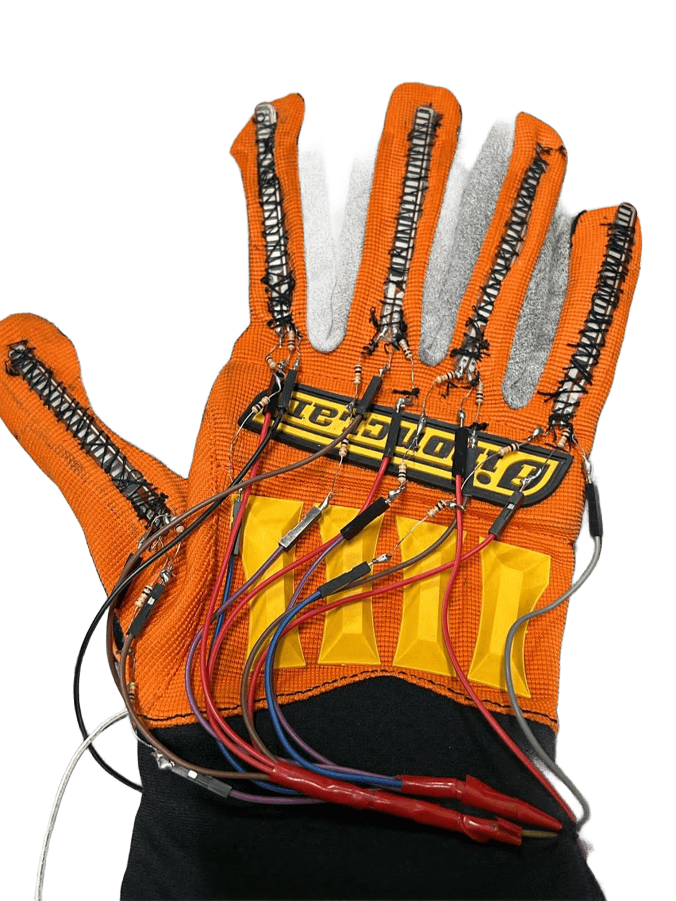
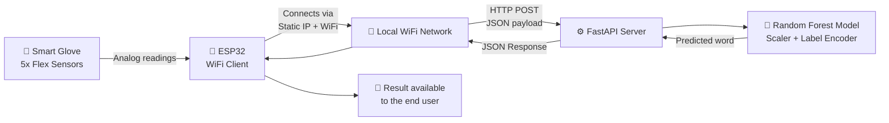

# 🧤 Smart Glove – Sign Language Translator

A smart glove fitted with 5 flex sensors connected to an **ESP32** microcontroller. The glove reads finger movement, sends the readings over **WiFi** to a **FastAPI** server running a trained **Machine Learning model (Random Forest)**, and gets back the matching word/sentence in sign language.

The goal is to help deaf and hard-of-hearing people communicate more easily by turning hand gestures into real-time text.

---

## 🌐 System Architecture & Networking

This is the part I was responsible for: designing how every component **connects and talks to each other** — the glove, the microcontroller, the WiFi network, and the backend server.



### How the components communicate

1. **Sensors → ESP32**: the 5 flex sensors are wired to the ESP32's analog pins (`GPIO 32–36`). The ESP32 reads each sensor value with `analogRead()`.
2. **ESP32 → WiFi Network**: the ESP32 is configured with a **static IP** (`WiFi.config()`) and connects to the local network using `WiFi.begin(ssid, password)`, so it always joins the network with a predictable address.
3. **ESP32 → API Server (HTTP)**: when the `/get-sensor-data` endpoint on the ESP32 is triggered, it packages the 5 sensor values into a JSON object (via `ArduinoJson`) and sends them as an `HTTP POST` request to the FastAPI server using `HTTPClient`.
4. **API Server ↔ ML Model**: the FastAPI server receives the JSON body, scales it with the saved `MinMaxScaler`, feeds it to the trained `Random Forest` model, and decodes the prediction back into a readable word with the `LabelEncoder`.
5. **API Server → ESP32 → User**: the predicted word comes back as a JSON response, which the ESP32 relays back to whoever called `/get-sensor-data` on it.

So the full loop is: **Glove → ESP32 (local network client) → WiFi → Cloud/Local API (server) → ML model → response back through the same path**. Getting this chain to talk correctly (async web server on the ESP32 side, HTTP client calls to an external API, matching JSON field names/types on both ends) was the main networking/integration challenge of this project.

---

## 🗂️ Repository Contents

```
.
├── model.py               # Trains the Random Forest model and saves it
├── main.py                 # FastAPI server that serves predictions
├── best_model.joblib        # Trained model
├── scaler.pkl                # MinMaxScaler used to preprocess sensor data
├── label_encoder.pkl          # Encodes/decodes predicted words
├── data                        # Sample request payload for testing
└── ESP_code/
    └── ESP_code.ino             # ESP32 firmware: reads sensors, connects to WiFi, calls the API
```

---

## ⚙️ Getting Started

### 1) Run the backend server

```bash
git clone https://github.com/USERNAME/Sign-Language-Translator.git
cd Sign-Language-Translator
pip install -r requirements.txt
python main.py
```

The server runs on: `http://0.0.0.0:8000`

### 2) Call the API

**Endpoint:** `POST /predict`

**Body (JSON):**
```json
{
  "sensor1": 347,
  "sensor2": 356,
  "sensor3": 332,
  "sensor4": 256,
  "sensor5": 457
}
```

**Response:**
```json
{
  "word": "ANA"
}
```

A sample payload for quick testing is provided in `data`.

### 3) Flash the ESP32

- Open `ESP_code/ESP_code.ino` in the Arduino IDE.
- Update your network credentials (`ssid` / `password`) and the `apiUrl` to point at your own server.
- Flash the ESP32.
- The device will read the sensors and POST the values to the server whenever `/get-sensor-data` is called.

> ⚠️ **Important:** `ESP_code.ino` currently has hardcoded WiFi credentials (SSID/password) in plain text. Remove or replace these before pushing to a public GitHub repo — move them into a separate `config.h` file and keep it out of version control (already excluded in `.gitignore`).

---

## 🧠 Model Training

The model is trained in `model.py` on real glove sensor data (CSV), and performs:
- Missing-value handling (`SimpleImputer`)
- Feature scaling (`MinMaxScaler`)
- Label encoding (`LabelEncoder`)
- **Random Forest Classifier** training with **GridSearchCV** for hyperparameter tuning
- Saving the model, scaler, and label encoder for use by the API

To retrain:
```bash
python model.py
```

---

## 🛠️ Tech Stack

| Layer | Technology |
|---|---|
| Microcontroller | ESP32 |
| Firmware / Networking | Arduino (C++), WiFi.h, HTTPClient, ArduinoJson, ESPAsyncWebServer |
| Backend | Python, FastAPI, Uvicorn |
| Machine Learning | scikit-learn (Random Forest) |
| Data Handling | pandas, numpy, joblib, pickle |

---

## 🚀 Roadmap

- [ ] Mobile/web app to display live translations
- [ ] Text-to-speech output
- [ ] Support for more gestures/words
- [ ] Multi-dialect / multi-language sign support

---

## 🤝 Contributing

Pull requests and suggestions are welcome. Open an issue or submit a PR for bug fixes and improvements.

## 📄 License

This project is available under the MIT License (feel free to change it).
