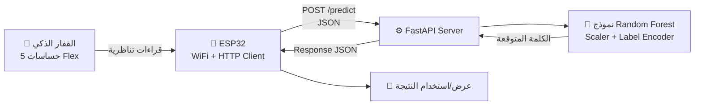

# 🧤 Smart Glove – Sign Language Translator

قفاز ذكي (Smart Glove) مزوّد بحساسات Flex متصلة بـ **ESP32**، بيقرأ حركة الأصابع ويبعتها لسيرفر **FastAPI** بيستخدم موديل **Machine Learning (Random Forest)** عشان يترجم إشارة اليد لكلمة أو جملة بلغة الإشارة العربية.

المشروع بيهدف لمساعدة الصم وضعاف السمع على التواصل بسهولة أكبر، من خلال تحويل حركة اليد لنص فوري.

---

## 📽️ فكرة المشروع



1. الحساسات الخمسة على القفاز بتقيس درجة انحناء كل إصبع.
2. الـ ESP32 بيقرأ القيم ويبعتها كـ HTTP Request لسيرفر الـ API.
3. السيرفر بيطبّع (Scale) البيانات، ويمررها على النموذج المدرَّب مسبقًا.
4. النموذج بيرجع الكلمة/الجملة المقابلة للإشارة (مثال: "أنا"، "أحبك"، "أريد"...).

---

## 🗂️ محتويات الريبو

```
.
├── model.py            # تدريب النموذج (Random Forest) وحفظه
├── main.py              # FastAPI server لعمل الـ prediction
├── best_model.joblib     # النموذج المدرَّب
├── scaler.pkl            # MinMaxScaler المستخدم في تجهيز البيانات
├── label_encoder.pkl     # لترميز/فك ترميز الكلمات
├── data                  # نموذج بيانات (sample request) للاختبار
└── ESP_code/
    └── ESP_code.ino       # كود الـ ESP32 لقراءة الحساسات وإرسالها للسيرفر
```

---

## ⚙️ طريقة التشغيل

### 1) تشغيل السيرفر (Backend)

```bash
git clone https://github.com/USERNAME/Sign-Language-Translator.git
cd Sign-Language-Translator
pip install -r requirements.txt
python main.py
```

السيرفر هيشتغل على: `http://0.0.0.0:8000`

### 2) استدعاء الـ API

**Endpoint:** `POST /predict`

**Body (JSON):**
```json
{
  "sensor1": 347,
  "sensor2": 356,
  "sensor3": 332,
  "sensor4": 256,
  "sensor5": 457
}
```

**Response:**
```json
{
  "word": "أَنَا"
}
```

فيه ملف بيانات تجريبي جاهز للاختبار في `data`.

### 3) رفع كود الـ ESP32

- افتح `ESP_code/ESP_code.ino` على Arduino IDE.
- عدّل بيانات الشبكة (`ssid` / `password`) وعنوان الـ API (`apiUrl`) بالقيم الخاصة بيك.
- ارفع الكود على الـ ESP32.
- الجهاز هيقرأ الحساسات ويبعتها تلقائيًا للسيرفر عند طلب `/get-sensor-data`.

> ⚠️ **مهم:** ملف `ESP_code.ino` فيه حاليًا بيانات شبكة WiFi ثابتة (SSID/Password) مكتوبة في الكود مباشرة. **لازم تشيلها أو تغيّرها قبل ما ترفع الريبو على GitHub**، عشان متسيبش بيانات حساسة ظاهرة للعامة. تقدر تحطها في ملف إعدادات منفصل (زي `config.h`) وتضيفه في `.gitignore`.

---

## 🧠 تدريب النموذج

النموذج اتدرب باستخدام `model.py` على بيانات حقيقية من القفاز (CSV)، وبيعمل:
- تنظيف البيانات المفقودة (`SimpleImputer`)
- تحجيم القيم (`MinMaxScaler`)
- ترميز التصنيفات (`LabelEncoder`)
- تدريب **Random Forest Classifier** مع **GridSearchCV** لاختيار أفضل الباراميترات
- حفظ الموديل والـ Scaler والـ Label Encoder كملفات جاهزة للاستخدام في الـ API

لإعادة التدريب:
```bash
python model.py
```

---

## 🛠️ التقنيات المستخدمة

| الفئة | التقنية |
|---|---|
| Microcontroller | ESP32 |
| Firmware | Arduino (C++) + ArduinoJson + ESPAsyncWebServer |
| Backend | Python + FastAPI + Uvicorn |
| Machine Learning | scikit-learn (Random Forest) |
| Data Handling | pandas, numpy, joblib, pickle |

---

## 🚀 تطوير مستقبلي

- [ ] إضافة واجهة موبايل/ويب لعرض الترجمة بشكل مباشر
- [ ] دعم تحويل النص الناتج لصوت (Text-to-Speech)
- [ ] توسيع عدد الإشارات المدعومة
- [ ] دعم لغة الإشارة بلهجات/لغات مختلفة

---

## 🤝 المساهمة

الـ Pull Requests والاقتراحات مرحّب بيها. لو عندك تحسين أو bug fix، افتح Issue أو ابعت PR.

## 📄 الترخيص

هذا المشروع متاح تحت رخصة MIT (تقدر تغيّرها حسب رغبتك).
